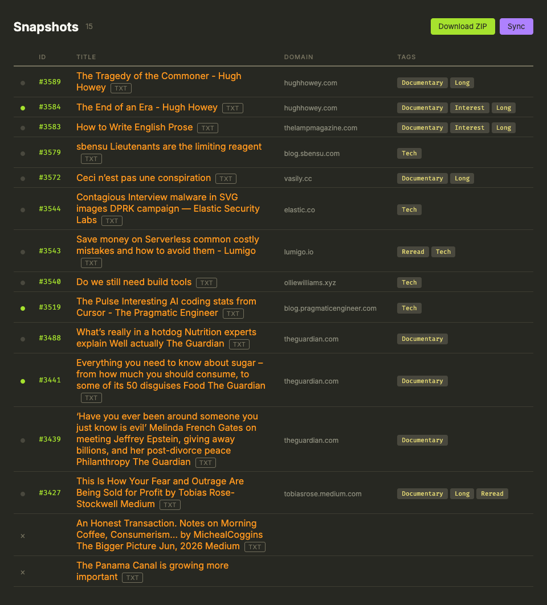

# linkding-snapshot-helper

A tiny web server that syncs [SingleFile](https://github.com/gildas-lormeau/SingleFile) snapshots from your [Linkding](https://github.com/sissbruecker/linkding) bookmarks and serves them as static files.

Built for offline reading: tag bookmarks in Linkding, let this pull the snapshots, then browse them from your phone or laptop without internet.



## Quick start

```bash
cp .env.example .env
# edit .env with your Linkding URL and API token
npm start
```

Open `http://localhost:8080` to browse your snapshots.

## Docker

```yaml
services:
  linkding-snapshot-helper:
    image: ghcr.io/limxingzhi/linkding-snapshot-helper:latest
    ports:
      - "8080:8080"
    environment:
      - LINKDING_URL=https://linkd.example.com
      - LINKDING_TOKEN=your-api-token-here
      - LINKDING_TAG=Offline
    volumes:
      - snapshots:/snapshots
      - logs:/logs

volumes:
  snapshots:
  logs:
```

## Configuration

All config is via environment variables (set them in `.env`):

| Variable | Default | Description |
|---|---|---|
| `LINKDING_URL` | (required) | Your Linkding instance URL |
| `LINKDING_TOKEN` | (required) | Linkding API token |
| `LINKDING_TAG` | `Offline` | Bookmark tag to sync |
| `PORT` | `8080` | Port to listen on |
| `SYNC_ON_START` | `true` | Sync snapshots on startup |
| `SNAPSHOT_DIR` | `/snapshots` | Directory to store snapshots |
| `ADMIN_SUBNET` | (empty — allow all) | Comma-separated CIDR ranges trusted as admin (e.g. `100.64.0.0/10` for Tailscale). When unset, every IP is trusted; delete + sync are restricted to it when set. Localhost is always trusted |
| `BASE_PATH` | (empty) | Serve the app under a path prefix, e.g. `BASE_PATH=/snapd` → `http://host:8080/snapd/` |
| `LINKDING_DISPLAY_URL` | (empty) | Public URL for Linkding, used for the `#id` links in the index instead of the internal `LINKDING_URL` host. The link becomes `<display>/bookmarks?details=<id>` |

## Endpoints

| Endpoint | Description |
|---|---|
| `GET /` | Directory listing of all downloaded snapshots |
| `GET /<filename>` | Serve a specific snapshot (`.html` only) |
| `GET /download.zip` | Download all snapshots as a ZIP archive |
| `GET /sync` | Re-sync from Linkding (skips already-downloaded files). Admin-only |
| `POST /delete` | Delete an unlinked snapshot. Admin-only |

All endpoints are served under `BASE_PATH` when set (e.g. `GET /snapd/`, `GET /snapd/sync`). The Sync and delete buttons are only shown to admin IPs; the Sync and delete routes return `403 Forbidden` to everyone else. The admin check runs against the client IP seen by the server (`X-Forwarded-For` is honored, since the app trusts proxies) — when running behind a reverse proxy, set `ADMIN_SUBNET` to your proxy's real client subnet.

## How it works

1. On startup (unless `SYNC_ON_START=false`), queries the Linkding API for all bookmarks tagged `#Offline`
2. For each bookmark, fetches its assets and filters for `asset_type == "snapshot"` (SingleFile uploads)
3. When multiple snapshots exist, selects the newest one by `created_at`
4. Downloads each snapshot as `<title>.html`, skipping files that already exist
5. Serves the downloaded files via Express

Syncs are idempotent: running `/sync` again only downloads new snapshots.

## Display URL overrides

The Domain column in the index links to the URL stored in Linkding. To point a snapshot at a different URL for display only, create `overrides.json` in the snapshot directory, keyed by bookmark ID:

```json
{ "42": "https://example.com/actual-article" }
```

Overrides are only used for display/linking in the index; Linkding is never modified and the file survives syncs.

## Requirements

- A Linkding instance with the [SingleFile extension](https://github.com/gildas-lormeau/SingleFile) configured to upload snapshots
- Node.js 18+
- Install dependencies: `npm install`

## License

MIT
